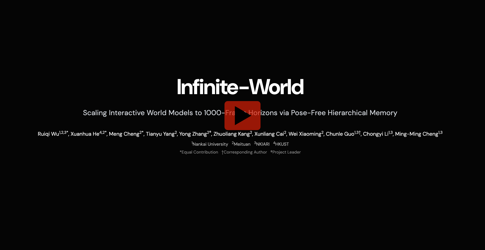

<h1 align="center">Infinite-World</h1>

<h3 align="center">Scaling Interactive World Models to 1000-Frame Horizons via Pose-Free Hierarchical Memory</h3>

<p align="center">
  <a href="http://arxiv.org/abs/2602.02393"></a>
  <a href="https://rq-wu.github.io/projects/infinite_world"></a>
</p>

<p align="center">
  <strong>Ruiqi Wu</strong><sup>1,2,3*</sup>, <strong>Xuanhua He</strong><sup>4,2*</sup>, <strong>Meng Cheng</strong><sup>2*</sup>, <strong>Tianyu Yang</strong><sup>2</sup>, <strong>Yong Zhang</strong><sup>2‡</sup>, <strong>Chunle Guo</strong><sup>1,3†</sup>, <strong>Chongyi Li</strong><sup>1,3</sup>, <strong>Ming-Ming Cheng</strong><sup>1,3</sup>
</p>

<p align="center">
  <sup>1</sup>Nankai University &nbsp; <sup>2</sup>Meituan &nbsp; <sup>3</sup>NKIARI &nbsp; <sup>4</sup>HKUST
</p>

<p align="center">
  <sup>*</sup>Equal Contribution &nbsp; <sup>†</sup>Corresponding Author &nbsp; <sup>‡</sup>Project Leader
</p>

<p>&nbsp;</p>
<p align="center">
  <a href="https://www.youtube.com/watch?v=4ZJrXpAMNbU"></a>
</p>
<p>&nbsp;</p>


---

## Highlights

**Infinite-World** is a robust interactive world model with:

- **Real-World Training** — Trained on real-world videos without requiring perfect pose annotations or synthetic data
- **1000+ Frame Memory** — Maintains coherent visual memory over 1000+ frames via Hierarchical Pose-free Memory Compressor (HPMC)
- **Robust Action Control** — Uncertainty-aware action labeling ensures accurate action-response learning from noisy trajectories

<p align="center">
  
</p>


## Installation

**Environment:** Python 3.10, CUDA 12.4 recommended.

### 1. Create conda environment

```bash
conda create -n infworld python=3.10
conda activate infworld
```

### 2. Install PyTorch with CUDA 12.4

Install from the official PyTorch index (no local whl):

```bash
pip install torch==2.6.0 torchvision==0.21.0 --index-url https://download.pytorch.org/whl/cu124
```


### 3. Install Python dependencies

```bash
pip install -r requirements.txt
```

---

## Checkpoint Configuration

All model paths are configured in **`configs/infworld_config.yaml`**. Paths are relative to the project root unless absolute.

### Download checkpoints

Download checkpoints from [https://huggingface.co/MeiGen-AI/Infinite-World](https://huggingface.co/MeiGen-AI/Infinite-World) and place files under `checkpoints/`:

| File / directory | Config key | Description |
|------------------|------------|-------------|
| `models/Wan2.1_VAE.pth` | `vae_cfg.vae_pth` | VAE weights |
| `models/models_t5_umt5-xxl-enc-bf16.pth` | `text_encoder_cfg.checkpoint_path` | T5 text encoder |
| `models/google/umt5-xxl` (folder) | `text_encoder_cfg.tokenizer_path` | T5 tokenizer |
| `infinite_world_model.ckpt` | `checkpoint_path` | DiT model weights |


---

## Results

### Quantitative Comparison

| Model | Mot. Smo.↑ | Dyn. Deg.↑ | Aes. Qual.↑ | Img. Qual.↑ | Avg. Score↑ | Memory↓ | Fidelity↓ | Action↓ | ELO Rating↑ |
|:------|:----------:|:----------:|:-----------:|:-----------:|:-----------:|:-------:|:---------:|:-------:|:-----------:|
| Hunyuan-GameCraft | 0.9855 | 0.9896 | 0.5380 | 0.6010 | 0.7785 | 2.67 | 2.49 | 2.56 | 1311 |
| Matrix-Game 2.0 | 0.9788 | **1.0000** | 0.5267 | **0.7215** | 0.8068 | 2.98 | 2.91 | 1.78 | 1432 |
| Yume 1.5 | 0.9861 | 0.9896 | **0.5840** | <u>0.6969</u> | **0.8141** | <u>2.43</u> | <u>1.91</u> | 2.47 | 1495 |
| HY-World-1.5 | **0.9905** | **1.0000** | 0.5280 | 0.6611 | 0.7949 | 2.59 | 2.78 | **1.50** | <u>1542</u> |
| **Infinite-World** | <u>0.9876</u> | **1.0000** | <u>0.5440</u> | <u>0.7159</u> | <u>0.8119</u> | **1.92** | **1.67** | <u>1.54</u> | **1719** |


## Citation

If you find this work useful, please consider citing:

```bibtex
@article{wu2026infiniteworld,
  title={Infinite-World: Scaling Interactive World Models to 1000-Frame Horizons via Pose-Free Hierarchical Memory},
  author={Wu, Ruiqi and He, Xuanhua and Cheng, Meng and Yang, Tianyu and Zhang, Yong and Kang, Zhuoliang and Cai, Xunliang and Wei, Xiaoming and Guo, Chunle and Li, Chongyi and Cheng, Ming-Ming},
  journal={arXiv preprint arXiv:2602.02393},
  year={2026}
}
```


## License

This project is released under the [MIT License](LICENSE).
